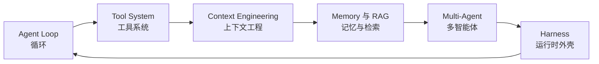

# Agent 工程讲义（pi 实现对照版）

这份讲义由本工作区编写，以 pi 的真实实现作为对照对象，覆盖 Agent 工程的主要设计位置。

pi 的安装在：

```
/Users/ricardolee/.nvm/versions/node/v22.22.2/lib/node_modules/@earendil-works/pi-coding-agent
~/.pi/agent/npm/node_modules/pi-subagents
```

这份讲义讲设计取舍，标注实现位置与关键结构。逐行代码的分析与从零实现放在 `.scratch/super-agent-practical-notes/`。

每一讲包含五个部分：生产中会遇到的问题、底层机制、实现要点、pi 的做法、常见错误，末尾附自检问题。

## 六大支柱



## pi 的分层与讲义章节的对应

| 层次 | 包与目录 | 讲义章节 |
|------|----------|----------|
| 模型调用层 | `node_modules/@earendil-works/pi-ai/dist` | 第 3、6、17 讲 |
| 循环与外壳层 | `node_modules/@earendil-works/pi-agent-core/dist`（`agent-loop.js`、`harness/`） | 第 2、5、14、27、28 讲 |
| 应用层 | `dist/core`（`agent-session.js`、`session-manager.js`、`tools/`、`compaction/`、`skills.js`、`system-prompt.js`、`trust-manager.js`） | 第 8 至 13、15、16、29 讲 |
| 编排层 | `pi-subagents`（`src/runs/`、`src/workflows/`、`docs/`） | 第 25、26 讲 |
| 接口层 | `dist/modes`（interactive / rpc）、`dist/core/sdk.js` | 第 30 讲 |

## 目录

### 第一章 认知校准

| 文件 | 标题 |
|------|------|
| `ch1-cognition/0-preface.md` | 从用法到判断力 |
| `ch1-cognition/1-agent-landscape.md` | 搞定 Agent 六大支柱 |
| `ch1-cognition/2-chatbot-to-agent.md` | 从 ChatBot 到 Agent：一个 while 循环 |
| `ch1-cognition/3-agent-llm-fundamentals.md` | 做 Agent 开发必须了解的大模型机制 |
| `ch1-cognition/4-framework-reality.md` | Agent 架构是否还停留在 LangChain 时代 |

### 第二章 Agent Loop

| 文件 | 标题 |
|------|------|
| `ch2-agent-loop/5-streaming-architecture.md` | 流式响应的工程实现 |
| `ch2-agent-loop/6-api-resilience.md` | 模型 API 故障时的生产级容错 |
| `ch2-agent-loop/7-loop-fuses.md` | Agent Loop 的三个保险丝 |

### 第三章 Tool System

| 文件 | 标题 |
|------|------|
| `ch3-tool-system/8-function-calling.md` | Function Calling 与 Structured Output |
| `ch3-tool-system/9-tool-pipeline.md` | 一次工具调用的完整过程 |
| `ch3-tool-system/10-dynamic-tools.md` | Deferred Loading 与动态工具集 |
| `ch3-tool-system/11-mcp.md` | MCP 的协议价值与接入代价 |
| `ch3-tool-system/12-skills.md` | Skills 与知识分发 |
| `ch3-tool-system/13-permissions.md` | 权限系统的四层防线与 pi 的替代方案 |

### 第四章 Context Engineering

| 文件 | 标题 |
|------|------|
| `ch4-context/14-context-overview.md` | Context Engineering 全景 |
| `ch4-context/15-system-prompt.md` | System Prompt 工程化与 Context Rot |
| `ch4-context/16-context-compression.md` | 上下文压缩 |
| `ch4-context/17-cache-cost.md` | Cache 与成本控制 |
| `ch4-context/18-jit-context.md` | Just-In-Time Context |
| `ch4-context/19-rag-pipeline.md` | RAG 全流程 |
| `ch4-context/20-retrieval-optimization.md` | 检索优化 |
| `ch4-context/22-knowledge-compilation.md` | LLM 编译知识库 |
| `ch4-context/23-memory-system.md` | Agent 记忆系统 |
| `ch4-context/24-memory-failures.md` | 记忆的五种失效模式 |

### 第五章 Multi-Agent

| 文件 | 标题 |
|------|------|
| `ch5-multi-agent/25-context-splitting.md` | 多智能体的作用是分割上下文 |
| `ch5-multi-agent/26-agent-swarm.md` | Agent Swarm 协作 |

### 第六章 Harness 进阶

| 文件 | 标题 |
|------|------|
| `ch6-harness/27-harness.md` | Harness 是什么 |
| `ch6-harness/28-hooks-observability.md` | Hook 与可观测性 |
| `ch6-harness/29-deployment.md` | 部署与调度 |
| `ch6-harness/30-acp.md` | 控制接口与 RPC 模式 |

### 第七章 回到框架

| 文件 | 标题 |
|------|------|
| `ch7-frameworks/31-langgraph.md` | 图结构控制流与显式循环 |
| `ch7-frameworks/32-framework-landscape.md` | 用六大支柱理解任何 Agent 框架 |
| `ch7-frameworks/33-end.md` | 能力自评与后续方向 |

## 使用方式

每个文件末尾的自检问题用来检验是否真正理解。答不出来的问题对应回去看「底层机制」与「pi 的做法」两节。读第 2 讲时打开 `agent-loop.js`，读第 16 讲时打开 `dist/core/compaction/compaction.js`，读第 28 讲时打开 `harness/hooks.js`，对照讲义里的结构自行核对一遍。