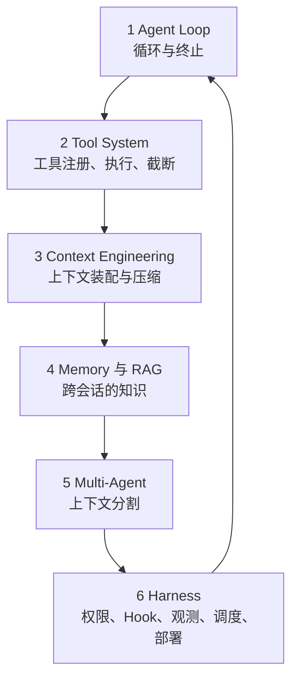

# 1 · 搞定 Agent 六大支柱

> 章节：第一章 认知校准

## 生产中会遇到的问题

新产品与新框架每月都在出现，每个都声称自己重新定义了 Agent。跟着看会疲于奔命，产品内部的代码又拿不到，能看到的只有演示视频与宣传文档。

把注意力从产品转移到支柱上可以解决这个问题。任何 Agent 产品都是六大支柱的不同组合方式，掌握支柱之后，看到新产品只需要识别它在这六个位置各做了什么选择。

## 底层机制

**支柱一：Agent Loop。** 决定程序以什么条件继续调用模型，以什么条件结束。关键设计点包括终止条件、最大轮数、重复动作检测、Token 预算。这一部分决定了程序的形状，也决定了失败时的表现。

**支柱二：Tool System。** 决定模型能看到哪些工具、工具的输入输出如何约束、结果如何截断、并发如何控制、权限如何校验。工具集合的大小直接影响模型的选择准确率，工具数量超过二十个之后选择错误会明显增加。

**支柱三：Context Engineering。** 决定每一轮请求里放进哪些内容，按什么顺序放，放多少。这是投入产出比最高的一根支柱。多数线上质量问题最终都会归结到上下文内容不合适，比如关键指令被长工具结果挤出注意力范围。

**支柱四：Memory 与 RAG。** 决定跨会话的知识如何保存与取回。这一部分解决的问题是上下文窗口之外的信息，区分点在于写入时机、存储结构、检索方式。

**支柱五：Multi-Agent。** 决定把一件事交给多个 Agent 处理时，上下文如何分割，结果如何汇总。多数情况下引入多个 Agent 的收益来自上下文隔离。

**支柱六：Harness。** 决定模型外面这层程序如何组织：权限校验在哪里插入、每一步如何记录、任务如何定时触发、程序如何部署、外部系统如何控制它。这一层的质量决定能否长期运行。

六根支柱之间存在依赖顺序。循环写不对，工具系统的问题会被掩盖成偶发故障；上下文装配写不对，工具再多也解决不了模型选错工具。

## 实现要点

判断一个新产品时，可以按固定顺序问六个问题。

1. 它的循环终止条件有哪些，最长会跑多少轮？
2. 它暴露了多少工具，工具描述多长，结果如何截断？
3. 它每一轮请求里放了什么，历史对话如何处理？
4. 它有没有跨会话的记忆，存在哪里？
5. 它有没有子智能体，上下文如何隔离？
6. 它如何限制危险操作，如何让使用者看到执行过程？

这套问题对任何产品都适用，包括没有公开代码的产品，因为行为可以在使用中观察出来。在自己的项目里，支柱对应的代码位置应当能够明确指出来。如果某个支柱找不到明确的实现位置，说明它被分散在各处，后续调整会非常困难。

## pi 的做法

pi 在六根支柱上的选择如下，后面的章节会逐个展开。

| 支柱 | pi 的位置 | 关键结构 |
|------|-----------|----------|
| Agent Loop | `pi-agent-core/dist/agent-loop.js` | 内层循环处理工具调用与插入消息，外层循环处理后续消息；`turn_start`、`turn_end`、`agent_end` 三类事件；`finishTurn` 可返回 `end` 结束整轮 |
| Tool System | `pi-coding-agent/dist/core/tools/` | 内置 `read`、`write`、`edit`、`bash`、`grep`、`find`、`ls`；工具定义里带 `executionMode`，决定该工具在批次中是顺序执行还是并发执行 |
| Context Engineering | `dist/core/system-prompt.js` 与 `pi-agent-core/dist/harness/compaction/` | 系统提示词按段落组装并支持增量打补丁；压缩按 Token 预算选定切点后交给模型生成结构化摘要 |
| Memory 与 RAG | 会话树 + 扩展提供的记忆层 | 会话以 JSONL 树保存并可从任意节点分支；本机 `~/.pi/agent/memory/` 由扩展维护长期记忆与检索 |
| Multi-Agent | `pi-subagents/src/runs/` | 子会话有 `fresh`、`fork`、`profile` 三种上下文模式，写操作可放进独立 worktree，额度按父任务划拨 |
| Harness | `pi-agent-core/dist/harness/` 与 `dist/core/` | Hook 注册表、事件总线、遥测、会话管理、信任判定、RPC 模式 |

pi 的自带工具数量是 8 个，处在选择准确率的安全范围内。子智能体侧通过 `tools` frontmatter 做白名单收窄，工具集合不继续扩张。

## 常见错误

第一个错误是跳过 Loop 直接做工具系统。循环结构没定型，工具的执行时机、并发控制、结果回传位置都会反复修改。

第二个错误是把工具当作 API 的包装。工具的接口是给模型看的，描述文字、参数命名、错误信息的写法都会影响调用准确率，这部分与普通 API 设计完全不同。

第三个错误是把上下文工程理解为压缩。压缩只是其中一个手段，装配顺序、信息取舍、指令位置同样重要。

第四个错误是过早引入多智能体。单个 Agent 的问题没有解决之前，引入多个 Agent 只会让问题更难定位。

第五个错误是最后才考虑 Harness。权限与观测如果等到上线前再补，通常需要修改大量已有代码。

## 自检问题

1. 你当前的项目里，六个支柱各自对应哪个文件或模块？
2. 你的工具集合有多少个，模型选错的频率如何？
3. 你的循环最多跑多少轮，跑满之后会发生什么？
4. 如果明天要接入一个新的模型供应方，需要改动几个位置？