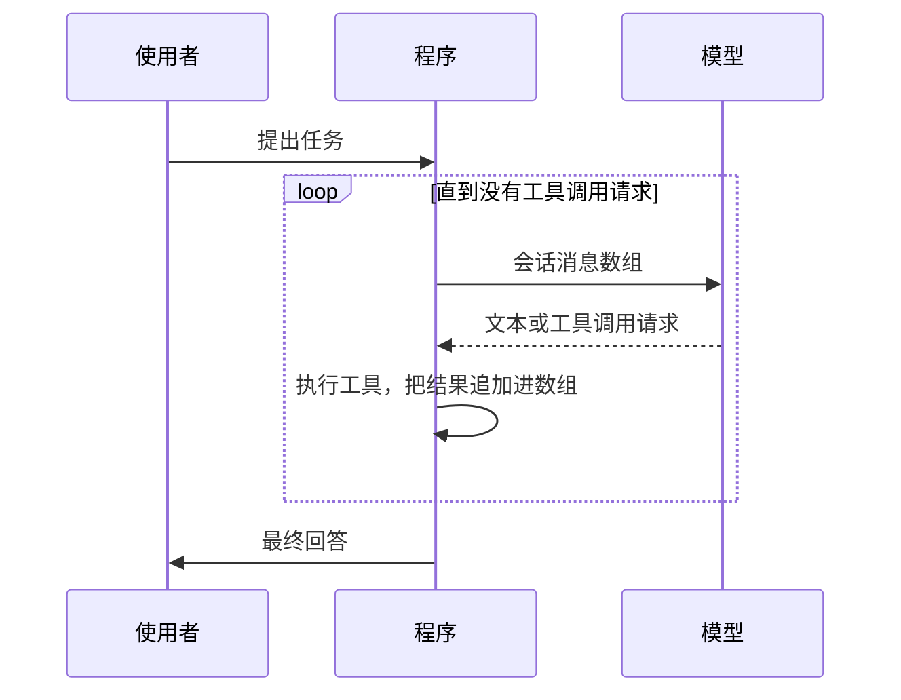

# 2 · 从 ChatBot 到 Agent：一个 while 循环

> 章节：第一章 认知校准

## 生产中会遇到的问题

聊天机器人的接口形态是单次请求单次响应：使用者输入文字，服务端调用一次模型，把结果返回，整个过程结束。这个形态下模型无法读取文件、无法执行命令、无法根据中间结果调整策略，因为它在一次调用里看不到任何外部信息。

Agent 的差别出现在结构上：模型可以在一次回答里要求调用工具，程序执行工具之后把结果交回模型，模型再决定下一步。这个来回可以重复任意多轮，直到模型给出最终答案。

## 底层机制

模型本身没有状态。它每一次被调用时只能看到本次请求里携带的内容。所谓「记得之前做过什么」，全部依靠程序在每一轮请求里重新提供历史内容。这一点决定了整个程序的数据结构。



循环的三个组成部分：

- **消息数组**：唯一的状态。每一轮追加模型输出与工具结果，下一轮完整提交。
- **终止判定**：模型输出里包含工具调用请求就继续，只有文本内容就结束。
- **工具执行**：把工具调用请求翻译成真实函数调用，把返回值整理成字符串。

## 实现要点

最小实现的两层结构如下。第一层负责一次请求与一批工具调用，第二层负责在使用者插入新消息时继续。

```typescript
while (true) {
  let hasMoreToolCalls = true;
  while (hasMoreToolCalls || pendingMessages.length > 0) {
    const message = await streamAssistantResponse(context, config, signal, emit);
    if (message.stopReason === "error" || message.stopReason === "aborted") return;

    const toolCalls = message.content.filter((c) => c.type === "toolCall");
    hasMoreToolCalls = toolCalls.length > 0;
    if (hasMoreToolCalls) {
      const results = await executeToolCalls(context, message, config, signal, emit);
      context.messages.push(...results);
    }
    pendingMessages = (await config.getSteeringMessages?.()) || [];
  }

  const followUpMessages = (await config.getFollowUpMessages?.()) || [];
  if (followUpMessages.length > 0) {
    pendingMessages = followUpMessages;
    continue;
  }
  break;
}
```

从这段代码到生产可用，中间还缺若干内容：并发的重复调用检测、单步超时、工具结果截断、错误结果的可读表达、Token 累计统计、取消能力。这些内容分布在后面的章节里。

## pi 的做法

`pi-agent-core/dist/agent-loop.js` 的 `runLoop` 就是上面这套双层结构，并且把两种消息的语义区分开。

| 概念 | 语义 | 进入时机 |
|------|------|----------|
| steering message | 使用者在一轮进行中打进来的补充要求 | 当前助手回合结束之后，立即作为待处理消息进入内层循环 |
| follow-up message | 已经排队的后续任务 | 内层循环即将停止时检查，发现就继续外层循环 |

几个可核对的结构细节：

- 循环开始前先取一次 steering 消息，处理「使用者等待期间已经输入」的情况。
- 每一轮开始前调用 `config.prepareNextTurn`，压缩这类耗时准备放在这里完成，准备结束后重新轮询一次 steering 消息。
- 每一轮请求前调用 `config.prepareRequest`，可以在这里替换上下文、模型、思考等级。
- 助手回应若是 `error` 或 `aborted`，直接结束整轮并发出 `agent_end`，不执行工具。
- 工具结果全部写回 `context.messages` 与 `newMessages`，前者供下一轮请求使用，后者用于对外汇报。
- 工具批次结束后调用 `config.finishTurn`，它返回 `end` 时可以终止整个运行。

模型输出里的工具调用从 `message.content` 里按 `type === "toolCall"` 取，与文本块共处一个数组。这一处结构决定了一个重要性质：文本与工具调用可以在同一条助手消息里出现，因此界面渲染与工具执行必须按块处理，不能假定一条消息只有一种类型。

## 常见错误

第一个错误是没有最大轮数限制。模型陷入重复调用同一个工具的循环时，程序会持续消耗额度直到报错。

第二个错误是工具执行出错时直接抛出。模型看不到错误内容就无法调整策略，正确的做法是把错误信息作为工具结果返回，并写成人能看懂的文字。

第三个错误是把工具结果当作内部数据完整返回。工具结果会占用上下文预算，一个大型目录的完整列表可能挤掉之前的指令。

第四个错误是并发执行有顺序依赖的工具。文件写入与文件读取有先后关系，必须按模型给出的顺序执行。

第五个错误是把消息数组当作日志。数组需要参与上下文装配，因此它的结构要服务于后续的压缩与截断，直接追加原始内容会让后续处理无从下手。

## 自检问题

1. 你的循环每轮提交给模型的完整内容是什么，能打印出来看一眼吗？
2. 模型反复调用同一个工具时，程序会在第几轮停下？
3. 工具返回错误时，模型收到的是什么文字？
4. 你的程序区分「进行中的补充消息」与「排队的后续任务」吗？