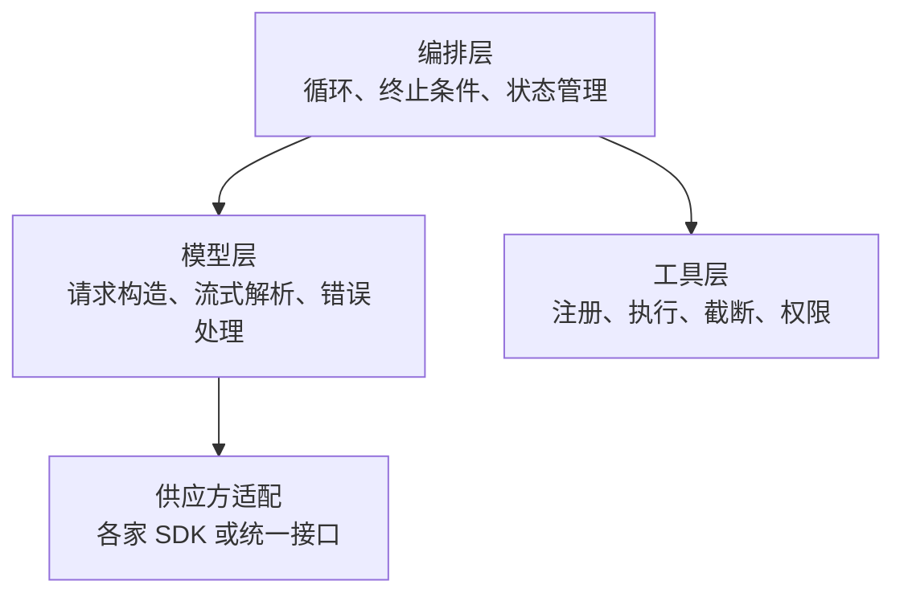

# 4 · Agent 架构是否还停留在 LangChain 时代

> 章节：第一章 认知校准

## 生产中会遇到的问题

用 Chain 编排的 Agent 项目在上线之后会遇到一类共同困难：行为不符合预期时无法定位是哪一步出了问题。链路被抽象成若干命名节点，每个节点内部对模型说了什么、模型回了什么，都需要额外打开调试开关才能看到。抽象层减少了初始代码量，代价是把真实请求隐藏起来。

## 底层机制

LangChain 时代的核心抽象是 Chain 与 Agent Executor。Chain 把一串调用串联起来，Executor 在内部实现循环。这套抽象的出发点是让开发者用声明式的方式描述流程，在模型能力较弱、需要大量人工编排提示词的时期是合理的。

模型能力提升之后，原本需要人工编排的部分越来越多地由模型自己完成。流程节点的价值从「告诉模型怎么做」变成「限制模型不能怎么做」。抽象层的收益随之下降，而它带来的约束开始产生影响：

- 请求内容不可见，调试需要穿过框架内部；
- 循环控制不灵活，插入自定义终止条件需要绕过框架机制；
- 版本更新引入破坏性变化，升级成本高于重写成本；
- 类型定义与实际返回值存在差距，编辑器无法提供准确提示。

## 实现要点

当前阶段较为稳定的做法是把程序分成三层。



编排层保留自己的循环实现。模型层负责把内部消息结构翻译成各家 API 需要的格式，并把流式事件解析成内部事件。工具层负责执行与结果处理。供应方适配部分可以使用薄封装，它的职责是统一请求格式，不接管循环。

框架仍然有适用场景。控制流本身很复杂时，例如带多个条件分支、需要状态回溯、需要人工审批节点的长流程，图结构框架提供的节点与检查点机制可以显著减少代码量。判断标准是控制流的复杂度。

选型时可以按以下问题自查：

1. 循环内部有多少个条件分支？超过五个说明控制流本身有复杂度。
2. 是否需要回到之前的某一步重新执行？
3. 是否需要持久化中间状态并在进程重启之后恢复？
4. 是否需要人工审批节点？
5. 更换模型供应方的代价有多大？

前四问的答案都是肯定时，图结构框架的收益会超过它的约束。

## pi 的做法

pi 没有采用框架的声明式编排，它把三层写成了三个包，每个包的边界清楚。

```
pi-ai            模型层。统一供应方接口、流式事件、重试分类、用量与成本、上下文溢出识别。
                 工具定义、消息类型、Token 估算也在这里。
pi-agent-core    编排层与外壳。agent-loop.js 是循环本身；harness/ 下放 Hook、事件总线、
                 遥测、会话存储、运行环境适配。
pi-coding-agent  应用层。会话管理、内置工具、压缩策略、技能、系统提示词、信任判定、界面模式。
```

这套分层带来三个可核对的结果：

- 循环可见。`agent-loop.js` 是普通 TypeScript，读一遍就能知道每一步做了什么，调试时不需要打开框架内部的开关。
- 供应方适配不侵入循环。新增一个模型供应方只在 `pi-ai` 的供应方目录里加文件，`agent-loop.js` 不需要改动。
- 请求可打印。`harness/hooks.js` 里的 `before_payload` 扩展点拿到的是即将发出的完整请求体，可以直接记录。

pi 对「回到之前的某一步重新执行」这类需求的处理方式是把会话做成树，任意节点都可以继续分支。回溯能力由会话存储承担，编排层保持线性。

## 常见错误

第一个错误是把框架当作架构。框架是依赖，架构是自己的分层方式，两者不能互相替代。

第二个错误是既用框架又绕过框架。在框架的循环内部手工插入自定义请求，会导致两条路径的行为不一致。

第三个错误是过早引入框架。项目只有工具调用与顺序执行时，框架提供的能力用不上，带来的调试困难却是实打实的。

第四个错误是把通用 Agent 抽象当作目标。内部项目里出现「通用 Agent 抽象」「通用工具适配器」这类设计，通常意味着为一个不存在的需求付出了复杂度。

## 自检问题

1. 你的项目里，模型请求的实际内容在哪个函数里构造？
2. 升级模型 SDK 需要修改几个文件？
3. 你的循环内部有几个条件分支？
4. 如果去掉框架，你的代码会减少还是增加？