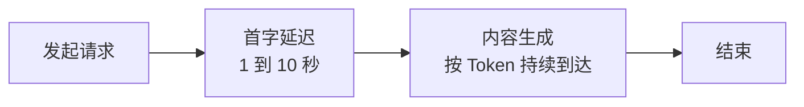

# 5 · 流式响应的工程实现

> 章节：第二章 Agent Loop

## 生产中会遇到的问题

非流式调用的表现是：使用者发送消息之后界面长时间没有变化，直到整段回答生成完毕才一次性出现。生成五百字回答需要十几秒，这段等待时间里使用者不知道程序在工作、卡住了、还是已经失败。

流式输出把等待时间的问题转化为首字延迟问题。使用者看到第一个字之后，后续内容的到达速度就不再敏感，因为阅读速度与生成速度可以并行。

## 底层机制

模型服务端返回的是事件流，每一个事件携带一个增量片段。事件类型大致分为三类：

| 事件类型 | 内容 |
|----------|------|
| 文本增量 | 一个或几个字符 |
| 思考增量 | 推理模型的思考内容片段 |
| 工具调用增量 | 调用开始、参数片段、调用结束 |

第三类事件需要注意：工具调用的参数是以字符串片段的形式陆续到达的，需要累积拼接之后再解析成对象。这解释了为什么流式模式下工具调用出错的比例高于非流式模式，累积逻辑写错会导致 JSON 截断。



首字延迟由模型排队时间与思考 Token 长度决定。推理模型在生成答案之前会先生成思考内容，这段时间使用者看不到任何输出，需要额外的进度提示。

## 实现要点

事件流的处理应当先转换成内部事件，再交给界面层。参数累积需要按调用标识分组保存，不能使用单一全局字符串，因为模型可能同时发起多个工具调用。

界面渲染需要节流。每个 Token 触发一次状态更新，在长回答场景下会产生大量重渲染。常见做法是按时间窗口合并，例如每 50 毫秒把累积的文本一次性提交给状态层。

工具执行期间应当有明确的界面状态。模型发起工具调用之后会等待结果，这段时间流是静止的，使用者看到的现象与停止响应相同。

中断能力需要在事件循环的每一层传递取消信号。取消之后除了停止请求，还要把已经产生的部分内容保存在会话记录里。

## pi 的做法

`pi-agent-core/dist/agent-loop.js` 的 `streamAssistantResponse` 是一个 `for await` 循环，把供应方事件翻译成两类内部事件。

```typescript
for await (const event of response) {
  switch (event.type) {
    case "start":
      partialMessage = event.partial;
      context.messages.push(partialMessage);
      await emit({ type: "message_start", message: { ...partialMessage } });
      break;
    case "text_delta":
    case "thinking_delta":
    case "toolcall_delta":
      partialMessage = event.partial;
      context.messages[context.messages.length - 1] = partialMessage;
      await emit({ type: "message_update", assistantMessageEvent: event, message: { ...partialMessage } });
      break;
    case "done":
    case "error": {
      const finalMessage = await response.result();
      context.messages[context.messages.length - 1] = finalMessage;
      await emit({ type: "message_end", message: finalMessage });
      return finalMessage;
    }
  }
}
```

可核对的设计点：

- 流式过程中的部分消息会就地替换消息数组的最后一项，不做追加。这样下一轮请求拿到的永远是当前完整状态，增量片段不会进入会话历史。
- 对外只发 `message_start`、`message_update`、`message_end` 三类消息级事件，界面层自己决定如何渲染与节流。`pi-agent-core` 不包含终端渲染代码。
- 参数累积由 `pi-ai` 的流式解析完成，`pi-agent-core` 拿到的 `toolcall_delta` 已经带上了当前的 `partial`。部分解析结果经过一个容错的 JSON 补救解析器处理，因此一个被输出长度截断的调用可能得到「能解析、能通过校验、但内容不完整」的参数。
- 正因为存在这种可能，`agent-loop.js` 对 `stopReason === "length"` 的助手消息做了特殊处理：`failToolCallsFromTruncatedMessage` 把这批调用全部标记为失败，理由写清楚「响应触达输出 Token 上限，参数可能被截断，请重新发起」。省略这一步会执行一批参数残缺的调用。
- 取消通过 `AbortSignal` 传递。工具执行前后、并发批次内的每一项都检查 `signal.aborted`，中止时返回 `Operation aborted` 的错误结果并停止批次。

## 常见错误

第一个错误是把文本增量直接存入消息数组。每一轮循环提交给模型的内容应当是完整消息，增量片段只用于渲染。

第二个错误是在参数片段到达时直接调用 JSON 解析。参数尚未接收完整时解析必然失败。

第三个错误是工具执行期间界面没有反馈。使用者会把正常的等待当作程序故障。

第四个错误是流式请求失败之后从头重试。已经渲染给使用者的内容会重复出现。

第五个错误是忽略用量事件。没有累计 Token 统计就无法做预算控制，也无法发现成本异常。

## 自检问题

1. 你的程序首字延迟是多少，其中工具定义与系统提示词占多少 Token？
2. 工具参数累积逻辑是按调用标识分组保存的吗？
3. 你的界面渲染有没有节流，长回答时帧率如何？
4. 输出被长度限制截断时，你的程序会执行那批工具调用吗？