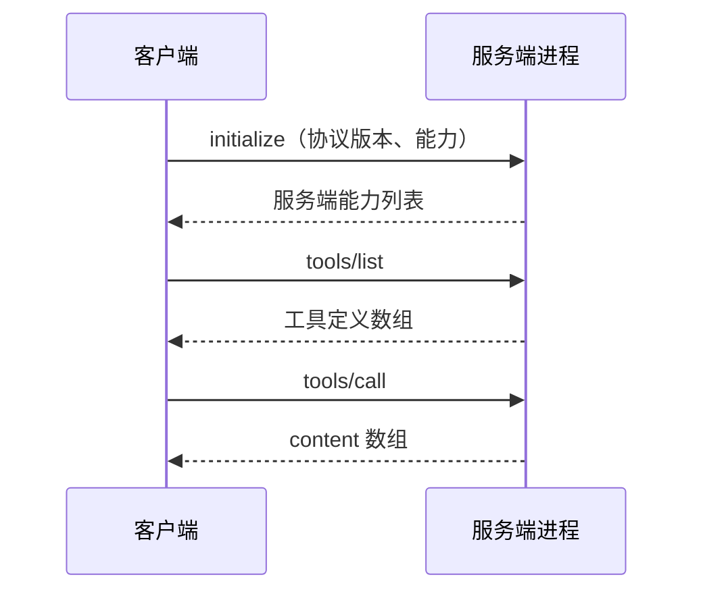

# 11 · MCP 的协议价值与接入代价

> 章节：第三章 Tool System

## 生产中会遇到的问题

同一个能力需要在多个 Agent 产品里使用时，每个产品各写一套工具实现会产生维护负担。MCP 解决的是这个复用问题：把工具实现做成独立进程或独立服务，通过统一定义的协议暴露出去，任何支持该协议的客户端都能接入。

协议层面的价值是明确的。实际接入时会遇到一批工程问题，这些问题在宣传材料里很少出现。

## 底层机制

协议基于 JSON-RPC，传输方式有两类：标准输入输出（客户端拉起子进程，通过管道通信），以及基于 HTTP 的远程传输。一次完整连接的过程是：客户端发起初始化请求，双方交换协议版本与各自支持的能力，之后进入正常请求阶段。

服务端可以暴露三类内容：

| 类型 | 用途 |
|------|------|
| tools | 可调用的能力，有输入结构 |
| resources | 可读取的数据，由客户端选择使用 |
| prompts | 预置的提示词模板，由使用者触发 |

## 实现要点

接入 MCP 时需要处理的工程问题：

**工具定义膨胀。** 一个功能完整的服务端可能暴露十几个工具，接入三个服务端之后工具总数就接近选择准确率的阈值。正确做法是把 MCP 工具纳入统一的动态加载机制。

**进程生命周期。** 标准输入输出模式下客户端负责拉起进程与回收。进程启动涉及依赖安装时，首次启动可能耗时数秒到数十秒。进程异常退出之后需要重启并重新初始化。客户端退出时要确保子进程被终止。

**认证。** 本地进程模式运行在当前使用者权限下，没有独立的鉴权环节。远程模式需要 OAuth 流程，令牌的保存与刷新由客户端负责。

**错误区分。** 协议错误与工具业务错误需要分开。工具返回内容里包含失败说明时，模型能据此调整；协议层错误说明连接有问题，需要程序处理。

**权限边界。** MCP 工具绕过宿主程序的权限系统是常见风险。宿主程序需要在调用入口统一拦截，判定逻辑必须覆盖来自 MCP 的调用。

**输出形态。** 返回内容是数组，元素可以是文本、图片、资源链接。宿主程序需要把非文本内容转换成模型可以理解的形式。

## pi 的做法

pi 核心不包含 MCP 客户端。这一点可以验证：`docs` 目录下没有任何 MCP 文档，`dist/core` 里没有 MCP 相关模块，工具集合由 `dist/core/tools/index.js` 固定导出 `read`、`write`、`edit`、`bash`、`grep`、`find`、`ls`、`powershell`。

pi 把 MCP 交给扩展。社区实现 `pi-mcp-adapter` 以扩展形式加载，能力因此受扩展机制的约束。`pi-subagents` 的文档记录了几条由此产生的实际限制，这些限制本身就是协议接入代价的实例。

| 限制 | 来源 | 原因 |
|------|------|------|
| MCP 工具必须在后台子智能体里使用 | `docs/agents.md` | 前台子智能体是父进程内的会话，不加载父级的扩展，因而拿不到适配器注册的工具 |
| 工具元数据在启动时缓存 | `docs/agents.md` | 连接新的 MCP 服务端之后需要重启，直接工具才可用 |
| `mcp:` 前缀只授予指定的 MCP 工具 | `docs/agents.md` | 严格白名单，不会连带放开内置工具 |
| 全局 `directTools: true` 不足以让子智能体拿到工具 | `docs/agents.md` | 子智能体需要在自身 frontmatter 里显式列出 `mcp:` 条目 |
| 运行时注册的服务端无法提供给子智能体 | `docs/agents.md` | 子智能体是进程内会话，无法接收 MCP 配置参数 |

排除项与包含项的策略在解析阶段强制执行：`includeTools` 与 `excludeTools` 同时支持精确名称与通配模式，`excludeTools` 优先。

这份限制表说明的是接入成本的位置：协议本身只规定消息格式，真正的复杂度在进程模型、扩展加载时机、权限收窄、工具元数据缓存这四处。

## 常见错误

第一个错误是把 MCP 服务端的全部工具无条件注入。工具数量增加之后选择准确率下降，收益被抵消。

第二个错误是不处理进程崩溃。服务端退出之后客户端继续发送请求，全部调用失败且没有明确提示。

第三个错误是忽略权限拦截。使用者以为配置里的禁止规则生效，通过 MCP 的调用却绕过了规则。

第四个错误是没有考虑加载时机。工具元数据在启动时读取，新增服务端之后没有重启，工具表现为不存在。

第五个错误是把远程服务的令牌写入配置文件并提交到仓库。

## 自检问题

1. 你接入的 MCP 服务端总共暴露多少个工具？
2. 服务端进程崩溃之后，客户端会做什么？
3. 你新增一个 MCP 服务端之后需要重启吗？
4. 通过 MCP 发起的调用会经过你的权限判定吗？