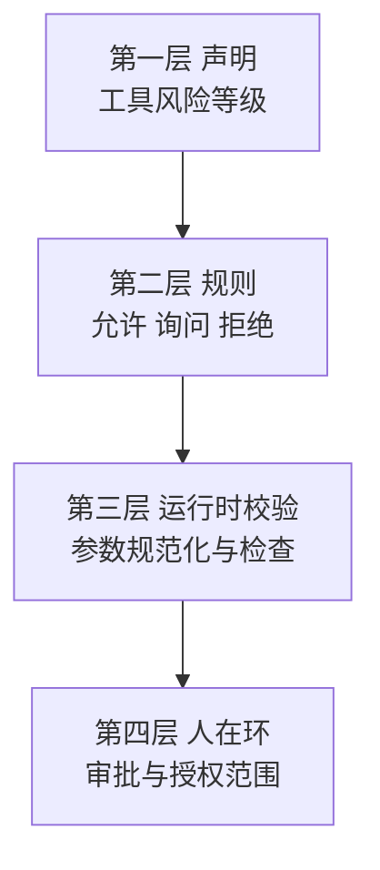

# 13 · 权限系统的四层防线与 pi 的替代方案

> 章节：第三章 Tool System

## 生产中会遇到的问题

Agent 具备执行命令与写入文件的能力之后，一次判断错误就可能删除数据、把密钥提交到仓库、或者修改生产环境的配置。在系统提示词里写「不要执行危险操作」不能作为防护手段，因为提示词属于建议，不构成约束。

## 底层机制

权限系统按四个层面组织，每一层的作用对象不同。



**第一层：声明。** 每个工具在注册时标注风险等级，例如只读、写入、执行、网络访问。

**第二层：规则匹配。** 使用者通过配置表达允许与禁止。规则需要支持参数级别的匹配，只按工具名称匹配会让读取与写入无法区分。

**第三层：运行时校验。** 参数传入的路径可能是 `../../etc/passwd`，可能是符号链接，可能是经过编码的形式。校验要求把路径解析为绝对路径之后判断是否处于允许范围内，符号链接需要解析到实际位置。字符串包含检查不能作为判定方式。

**第四层：人在环。** 校验无法自动判定时进入人工审批。审批结果的作用范围需要明确：单次有效、本次会话有效、永久有效。超时应当默认拒绝。

沙箱是第三层的强化形态：把执行放在受限环境内，文件系统只挂载必要目录，网络访问默认关闭，资源使用设置上限。

## 实现要点

路径校验的实现顺序是先解析再判断。

```typescript
function checkPath(raw: string, workspaceRoot: string): CheckResult {
  const resolved = fs.realpathSync(path.resolve(workspaceRoot, raw));
  const root = fs.realpathSync(workspaceRoot);
  if (resolved !== root && !resolved.startsWith(root + path.sep)) {
    return { allowed: false, reason: `路径超出工作目录范围：${resolved}` };
  }
  return { allowed: true };
}
```

拒绝时需要把理由返回给模型。模型看不到理由时会尝试其他路径绕过限制。

## pi 的做法

pi 采用的方案与上面的四层不同，它明确放弃了逐次审批，把安全边界交给操作系统与虚拟化。`docs/security.md` 的表述很直接：pi 会以启动它的账号权限读取、修改、执行文件，不会在每次工具调用之前请求批准；安全性来自限制 pi 能访问的文件、凭证、进程与网络服务。转录审查与项目信任不构成安全边界。

这套选择的组成如下。

**项目信任。** 只控制启动时是否加载项目提供的可执行资源。需要信任决策的资源清单写在 `dist/core/trust-manager.js` 里：`.pi/settings.json`、`.pi/extensions`、`.pi/skills`、`.pi/prompts`、`.pi/themes`、`.pi/SYSTEM.md`、`.pi/APPEND_SYSTEM.md`，以及当前目录或祖先目录下的 `.agents/skills`。决策优先级为：命令行参数、扩展处理 `project_trust` 事件、已保存决策、全局 `defaultProjectTrust` 设置。决策保存在 `~/.pi/agent/trust.json`，键是规范化之后的绝对路径，读取与写入带文件锁。查找时从当前目录向上取最近的一条决策。

文档同时列明了信任机制的边界：项目 `sessionDir` 设置会在信任判定之前被读取，因此拒绝信任无法撤销这一次目录查找；上下文文件（`AGENTS.md`、`CLAUDE.md` 等）无论如何都会被加载，使用者应当把它们当作不可信输入。

**运行环境隔离。** `docs/security.md` 把三种运行方式并列比较：直接以当前账号运行（只能依赖账号权限），完全放进容器或沙箱（保护最强），以及只把内置工具放进隔离环境（保护范围较窄，pi 自身与扩展仍在边界之外）。

**扩展点在工具执行前后。** `pi-agent-core/dist/harness/hooks.js` 的 `before_tool` 可以阻止执行并给出理由，`after_tool` 可以改写结果。需要「某些工具必须经过确认」的使用方可以在这个位置实现，pi 自身不提供内置规则。

**子智能体侧的收窄。** `pi-subagents` 用 `tools` frontmatter 做严格白名单，用能力上限（capability ceiling）限制子智能体可用的扩展与工具，`src/runs/shared/permissions.ts` 与 `src/watchdog/permission-arbiter.ts` 负责相关判定。外部命令行代理相关的文档明确指出：不要把完整访问权限或审批绕过交给这些代理。

## 常见错误

第一个错误是把提示词当作权限控制。提示词可以被模型忽略，也可以被工具返回内容影响。

第二个错误是用字符串包含判断路径。`/workspace-other` 以 `/workspace` 为前缀，字符串判断会放行。

第三个错误是不解析符号链接。链接指向目录外部时，路径检查全部通过。

第四个错误是把项目信任当作安全边界。信任只决定启动时加载哪些资源，不限制工具调用能访问什么。

第五个错误是把审批超时设置为默认允许。程序在无人在场时自动执行了危险操作。

## 自检问题

1. 你的工具里有几个可以执行任意命令，几个可以写入文件？
2. 路径校验解析符号链接了吗？
3. 你的权限判定发生在工具执行之前还是之后？
4. 你的运行环境在容器里，还是与宿主机共享账号权限？