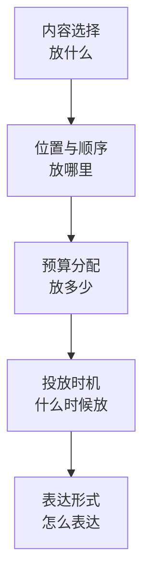

# 14 · Context Engineering 全景

> 章节：第四章 Context Engineering

## 生产中会遇到的问题

同一个模型、同一套工具，两个项目的效果差别很大。差别出现在每一次请求的内容上：放了什么、放在什么位置、放了多少、什么时候放、用什么形式表达。这五件事构成 Context Engineering 的全部内容。

## 底层机制



**内容选择。** 每一轮请求的组成部分包括：系统提示词、工具定义、会话历史、检索结果、记忆条目、工具执行结果、本次任务说明。每一部分都需要判定本次任务是否用得上。

**位置与顺序。** 序列开头与结尾的信息被利用的比例高于中部。关键约束放在开头，最近的任务说明放在结尾，工具结果紧跟在对应的调用之后。

**预算分配。** 上下文窗口是有限资源，各部分需要配额。固定开销包括系统提示词与工具定义，可变开销包括会话历史与工具结果。

**投放时机。** 全部内容提前装配会产生两类浪费：放进去用不上的内容，以及需要时已经放不进去的内容。

**表达形式。** 同样信息可以写成自然语言、结构化表格、文件路径加摘要。事实性信息适合结构化表达，流程性信息适合自然语言表达，大块内容适合用路径与摘要代替。

## 实现要点

上下文装配应当集中在一个函数里，并且可以完整打印。

```typescript
function buildRequest(state: SessionState, task: Task): ModelRequest {
  return {
    system: composeSystemPrompt(state, task),
    tools: selectTools(task),
    messages: [
      ...selectHistory(state, task),
      ...injectMemory(state, task),
      ...injectRetrieval(state, task),
      task.currentMessage,
    ],
  };
}
```

集中装配的价值在于可观测。装配结果可以按 Token 数量分解成几个部分。分散在各处拼接的请求无法做这种统计。

## pi 的做法

pi 把装配分成两个明确的位置，系统提示词与消息序列各归一处。

**系统提示词的装配位置。** `dist/core/system-prompt.js` 的 `buildSystemPromptSections` 返回一个按名称索引的段落对象。

| 段落名 | 内容 | 何时存在 |
|--------|------|----------|
| `preamble` | 身份说明与工具清单 | 始终 |
| `tools` | 由各工具的 `promptSnippet` 合成 | 使用默认提示词时 |
| `rules` | 由各工具的 `promptGuidelines` 与全局规则合成 | 使用默认提示词时 |
| `docs` | pi 自身文档的路径索引 | 使用默认提示词时 |
| `addendum` | 使用者追加的系统提示词 | 有追加内容时 |
| `project_context` | 上下文文件，包裹在 `project_instructions` 标签里 | 发现上下文文件时 |
| `skills` | 可用 Skill 清单 | 有 Skill 时 |
| `cwd` | 当前工作目录 | 始终 |

段落对象最终渲染成带标签的文本，每个段落被自己的标签包裹。这个结构有两个直接收益：段落可以按名称单独替换；模型看到的是有边界的区块。

**消息序列的装配位置。** `pi-agent-core/dist/agent-loop.js` 在发出请求之前依次做三件事：

```typescript
if (config.transformContext) {
  messages = await config.transformContext(messages, signal);
}
const llmMessages = await config.convertToLlm(messages);
const llmContext = normalizeContext({ messages: llmMessages });
```

第一处是扩展点，可以在这一步改写消息序列。第二处把内部消息类型转成供应方需要的形态。第三处做归一化。三处分开的价值在于：内部消息类型可以比供应方支持的形态更丰富，转换逻辑集中在一处。

**投影与分支。** 会话是树结构，每一轮请求用到的是从根到当前节点的这一条路径。`dist/core/session-manager.js` 的 `buildSessionProjection` 负责把路径上的条目投影成消息序列。压缩条目、分支摘要条目、上下文编辑条目在这一步被展开或省略，原始条目仍然保留在文件里。

## 常见错误

第一个错误是把上下文工程等同于压缩。压缩只解决长度问题，内容选择与顺序问题造成的损失无法通过压缩弥补。

第二个错误是不打印请求全文。出问题时只能靠推测，无法定位。

第三个错误是把系统提示词写成一整段连续文字。无法按部分替换，也无法判断哪一部分占用最多。

第四个错误是把所有检索结果无条件放入。检索结果的准确率有限，错误内容会直接影响回答。

第五个错误是调整时同时改动多个维度。效果变化无法归因。

## 自检问题

1. 你能打印出最近一次请求的完整内容，并按部分统计 Token 数量吗？
2. 你的系统提示词是按段落组织的，还是一整段连续文字？
3. 你的工具结果有没有独立的长度上限？
4. 上下文装配集中在几个位置？