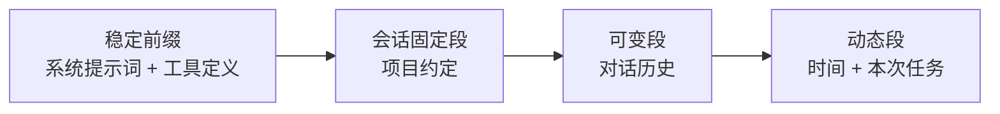

# 17 · Cache 与成本控制

> 章节：第四章 Context Engineering

## 生产中会遇到的问题

同一段系统提示词在每一轮请求中重复发送，成本按轮数成倍累积。一个五十轮的代码任务，系统提示词与工具定义的重复开销可能超过实际新增内容的开销。缓存机制处理的是这部分重复。

## 底层机制

三个概念的作用范围不同，混在一起会导致优化方向出错。

| 概念 | 作用范围 | 是否由使用方控制 |
|------|----------|------------------|
| KV Cache | 单次请求内部的解码过程 | 否，服务实现决定 |
| Prompt Cache | 跨请求的相同前缀 | 是，通过组织请求内容 |
| 上下文折叠 | 把长历史替换成更短表示 | 是，属于压缩手段 |

KV Cache 是解码过程的必要优化。生成每一个 Token 时，模型需要对历史所有 Token 计算键值，这部分结果可以复用。这份复用使得流式输出成立。

Prompt Cache 把复用扩展到请求之间。命中条件十分严格：前缀逐字节一致。缓存的价格结构与普通输入不同，写入价格高于普通输入，读取价格远低于普通输入。因此收益出现在前缀被多次复用的场景，一次性请求使用缓存反而增加成本。缓存有存活时间，超过时间之后需要重新写入。

## 实现要点

请求内容的组织方式直接决定缓存命中率。



稳定前缀放在最前面，动态内容放在最后。时间戳、请求标识、随机数出现在前缀中会让缓存全部失效。

工具定义的序列化顺序需要固定。通过遍历对象生成的数组顺序在部分运行环境下会变化，应当显式按名称排序。

成本追踪按四个维度记录：输入 Token、输出 Token、缓存写入 Token、缓存读取 Token。只有输入与输出两项时无法判断缓存是否生效。

## pi 的做法

pi 在缓存的三个位置都有实现：成本统计、读缓存、写缓存。

**统计口径。** `pi-ai` 的用量结构固定包含 `input`、`output`、`cacheRead`、`cacheWrite`，另有 `totalTokens` 与分类成本。会话记录里还有一种独立的 `usage` 条目，`kind` 字段标记用途，例如缓存续期记为 `cache_warm`，它参与总量与费用统计，但不进入对话树。

**失效检测。** `dist/core/cache-stats.js` 对每一轮做一次误失判定，规则如下。

```typescript
const NOISE_FLOOR_TOKENS = 1024;
export const CACHE_TTL_MS = 5 * 60 * 1000;

function detectMiss(prev, message, models) {
  const promptTokens = usage.input + usage.cacheRead + usage.cacheWrite;
  if (!prev || promptTokens <= 0 || (usage.cacheRead + usage.cacheWrite === 0 && !prev.reportedCache)) {
    return undefined;
  }
  const missedTokens = Math.min(prev.promptTokens, promptTokens) - usage.cacheRead;
  if (missedTokens <= NOISE_FLOOR_TOKENS) return undefined;
  ...
}
```

要点有三处：

- 低于 1024 Token 的差值不计入，因为缓存断点的粒度本身会造成小幅度波动。
- 首次请求、压缩条目与分支摘要条目之后的重置不计入，因为那些位置的上下文确实发生了变化，属于新内容，不计入重复计费。
- 模型切换**不**豁免。切换模型会重新计费整个提示词，属于真实的浪费，应当被统计出来。

误失成本按「本应付的缓存读取单价」与「实际付的输入或缓存写入单价」之差乘以误失 Token 数计算，因此统计出的是金额。统计结果可以按会话累计，也可以在每条助手消息上单独提示。

**续期。** `dist/core/cache-warmer.js` 是一个主动保持缓存命中的组件。

```typescript
const CACHE_WARMING_MINIMUM_EXPECTED_SAVINGS = 0.05;
const IDLE_CONTINUATION_PROBABILITY = 0.15;
export function getCacheWarmingDelayMs(ttlMs) {
  if (ttlMs <= 10_000) return undefined;
  return Math.max(1, Math.floor(Math.min(ttlMs * 0.9, ttlMs - 10_000)));
}
```

它的工作方式是：在一次真实请求之后，按缓存存活时间的九成安排一次带一 Token 输出上限的重放请求，把缓存条目续上。是否值得续期要先算一笔账：预期节省低于 0.05 美元就不发。空闲状态下的续期还要乘以一个 0.15 的「使用者会回来继续」概率，因为空闲时段的预估更不可靠。续期请求自身不重试（`maxRetries: 0`），失败就放弃。

**可重放性判断。** 并非所有请求都能安全重放。`isReplayable` 检查推理参数与接口类型：Anthropic 的消息接口在开启思考且未使用自适应思考时，思考预算由 `maxTokens` 推导，重放会得到不同的预算，而缓存键与这个预算相关，因此这种情况判定为不可重放。

**与压缩的配合。** 压缩改变消息前缀，压缩之后的第一轮请求必然缓存失效。缓存统计里对此做了例外处理，避免把压缩引起的正常变化报成浪费。

## 常见错误

第一个错误是在系统提示词里写入当前时间。缓存命中率降为零。

第二个错误是只统计输入与输出 Token。无法发现缓存失效。

第三个错误是把模型切换当作正常情况。切换模型会重新计费整个提示词，属于需要统计的浪费。

第四个错误是不设噪声下限。缓存断点粒度造成的几十上百 Token 波动被反复报成问题，真正的浪费被淹没。

第五个错误是续期请求本身参与重试。续期失败无关紧要，重试只会增加成本。

## 自检问题

1. 你的用量统计里有 `cacheRead` 与 `cacheWrite` 两项吗？
2. 你的系统提示词前缀在连续两次请求之间完全一致吗？
3. 你的程序能算出某一次缓存误失造成的额外金额吗？
4. 你了解所用模型的缓存存活时间吗？