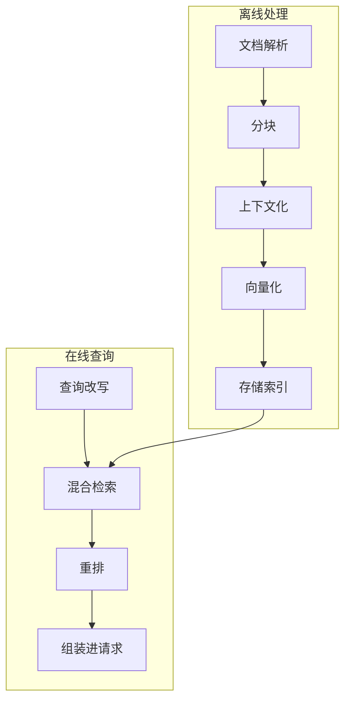

# 19 · RAG 全流程

> 章节：第四章 Context Engineering

## 生产中会遇到的问题

把文档向量化之后放进向量库，使用者提问时检索出若干片段交给模型，回答仍然不准确。问题极少出在向量库上，多数出在分块方式与组装方式上：片段缺少上下文，或者多个片段之间的矛盾没有被处理。

## 底层机制



**文档解析。** 纯文本与 Markdown 直接可用，PDF 需要处理分栏与表格，网页需要去掉导航与广告。

**分块。** 固定长度分块实现简单，会在句子中间切断。按结构分块保留语义完整性，要求文档本身有结构。实践中常用的组合是按结构分块，块内长度超出上限时再按长度切割，块之间保留少量重叠。

**上下文化。** 单独一个片段常常缺少主语与场景。给每个片段补充所属文档的标题、章节路径与简短说明，可以显著提升检索与回答质量。

**向量化与存储。** 存储内容包括向量、原文、元数据。元数据是后续过滤的依据。

**在线查询。** 查询改写处理使用者口语与文档用词不一致的问题。混合检索同时使用关键词匹配与向量检索。重排对候选结果重新打分。

**组装。** 放入请求时保留来源与相关度。多条内容互相矛盾时需要在请求中说明。

## 实现要点

检索在 Agent 里的位置与在传统问答系统里不同。传统做法把检索放在固定前置步骤，Agent 的做法是把检索做成工具，由模型决定是否检索、检索什么、检索几次。

```typescript
const searchKnowledge = tool({
  description: '在知识库中检索。需要项目约定、历史决策、接口说明时使用。',
  inputSchema: z.object({
    query: z.string().describe('检索问题，使用完整的疑问句'),
    scope: z.enum(['all', 'decisions', 'patterns', 'references']).optional(),
    topK: z.number().int().min(1).max(10).default(5),
  }),
});
```

参数里的 `scope` 让模型可以缩小检索范围，减少无关结果。返回内容应当包含来源路径与相关度，格式统一。

## pi 的做法

pi 核心不内置向量库与检索管线。可核对的证据是：`dist/core` 下没有向量存储或嵌入模型相关模块，内置工具集合里与检索相关的是 `grep`、`find`、`ls` 三个基于文件系统的工具。

检索能力由两处提供。

**第一处：文件系统工具作为检索入口。** `grep` 按内容检索，`find` 按文件名检索，`ls` 按目录结构查看。这三者组合起来覆盖了「找到相关代码或文档」这一主要需求，而且是精确匹配，不依赖向量质量。单行结果截到 500 字符，避免匹配行本身占用过多上下文。

**第二处：扩展提供的记忆与检索层。** 本机 `~/.pi/agent/memory/` 目录由扩展维护长期记忆，并提供按关键词、语义与深度三种模式的检索。这部分不在核心包里，属于可替换的组件。

**第三种形态：会话树作为上下文检索。** 这一处常被忽略，但它是一个真实的检索机制。会话是树结构，任意节点都可以继续分支。需要回到之前的某个状态时，可以从那个节点重新开始，不需要把整个历史重新塞进请求。`dist/core/compaction/branch-summarization.js` 负责在切换分支时把原分支的关键信息压缩成一份摘要，带进新分支。检索的对象是「历史工作状态」，取回方式是分支切换，这与片段检索解决的问题不同，但目标一致：让当前请求只包含当前需要的内容。

**子智能体侧的上下文模式。** `pi-subagents` 提供 `fresh`、`fork`、`profile` 三种上下文模式。`fork` 会把父会话的记录带进子会话，并可以按规则剪枝（`pruned-fork`）。这是把「检索到的上下文」以整段会话的形式交给子任务，与片段召回是两种不同的粒度。

pi 这套选择的代价也很清楚：需要语义检索时依赖扩展，扩展不在场时只有精确匹配；知识库不能跨产品复用，因为内容以文件形式存在于某个工作目录里。

## 常见错误

第一个错误是分块时不留重叠。跨块的句子在两边都读不到完整含义。

第二个错误是片段不带来源。模型无法引用，使用者无法核实。

第三个错误是只使用向量检索。包含具体编号、函数名、错误码的查询会失效。

第四个错误是把检索结果直接拼接。多条结果缺少分隔与标注，模型分不清边界。

第五个错误是忽略精确匹配工具的价值。代码与配置类内容用关键词检索的准确率通常高于向量检索，先做简单方案能省下大量调参时间。

## 自检问题

1. 你的分块方式是什么，块与块之间有重叠吗？
2. 每个片段带有来源与章节信息吗？
3. 你的检索同时支持关键词与向量两种方式吗？
4. 检索是固定前置步骤，还是由模型决定？