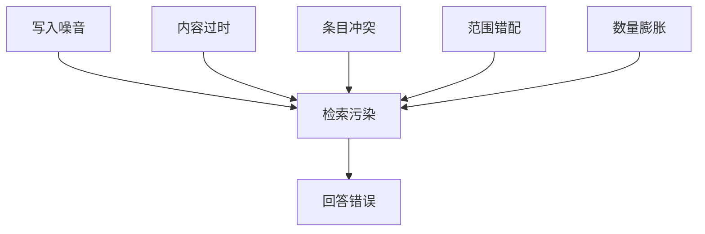

# 24 · 记忆的五种失效模式

> 章节：第四章 Context Engineering

## 生产中会遇到的问题

记忆系统上线一段时间后出现一批难以定位的问题：模型引用了错误的项目信息、坚持一个早已不成立的结论、对同一个事实给出前后不一致的回答。这些问题的共同点是记忆本身出了问题。

## 底层机制

**失效模式一：写入噪音。** 把每次对话的细节都用记忆保存，真正有价值的结论被大量临时内容淹没。

**失效模式二：内容过时。** 记录写下时是正确的，之后事实发生变化，记忆没有随之更新。

**失效模式三：条目冲突。** 同一事实存在多条记录，内容互相矛盾。检索只取回其中一条，取回哪条取决于排序结果。

**失效模式四：范围错配。** 记忆没有标注适用范围，在一个项目里得到的做法被应用到了另一个项目。这类错误最难发现，因为内容是错的但表述看起来合理。

**失效模式五：数量膨胀。** 条目持续增加，检索阶段需要处理的数据量上升，命中质量下降。

## 实现要点

| 失效模式 | 处理方式 |
|----------|----------|
| 写入噪音 | 限制写入触发条件，只在明确要求或任务结论时写入 |
| 内容过时 | 记录更新时间，定期核对，事实性内容标注核查来源 |
| 条目冲突 | 写入前做冲突检测，发现矛盾时保留双方并标注 |
| 范围错配 | 每条记忆标注作用范围，检索时按当前上下文过滤 |
| 数量膨胀 | 设置生命周期状态，长期未引用且内容平淡的条目归档 |

**冲突检测的三个层次。**

同文件内冲突：新条目与同文件已有条目描述同一事实但结论不同。

跨文件冲突：新条目与另一个文件里的条目矛盾。

隐含冲突：新条目与某条已被引用多次的结论不一致，但没有直接相同的表述。

第三类最难发现，需要按主题关键词做一次检索再判断。检测成本与写入频率成正比，因此写入频率需要控制。

**衰减与归档。** 长期未被检索命中的条目降低排序权重，超过某个时间且引用次数为零的条目移入归档目录。

## pi 的做法

前面五种失效模式在 pi 的记忆结构里各有一个对应的处理位置。

**写入噪音的对策是内容分流。** 长期条目、当天记录、待处理事项分属三个位置，写入时机各不相同。日常过程不会自动进入长期条目，这一条分流规则是抑制噪音最有效的措施：绝大多数噪音来自把过程当成结论写入。

**内容过时的对策是状态字段。** 条目带更新时间与成熟度两项。成熟度为已废弃或已归档的条目不再参与检索内容，但仍留在文件里作为判断依据。这与「删除过时条目」不同，删除会丢掉推演过程，标记状态可以保留。

**条目冲突的对策是删除加恢复。** 处理一个已经不成立的结论时，工具的语义是「按匹配内容删除」并生成一条恢复记录，新结论作为新条目重新写入。同一时刻文件里的内容是自洽的，历史状态保存在恢复记录里。这样不存在「两条矛盾记录谁被检索到」的问题。

**范围错配的对策是作用范围字段与检索过滤。** 每条记忆标注全局、某个仓库或某个业务域。检索时按当前目标过滤，范围不符的条目在排序之前就被排除。共同的判断标准写在写入规则里：新记忆前需要检查同文件、跨文件、以及隐含冲突三个层次。

**数量膨胀的对策是引用次数与分层检索。** 引用次数记录条目被使用过多少次，与最近生效时间一起支撑衰减判定。检索默认走关键词模式，先按标题与说明匹配，命中之后才读完整条目，因此文件总量的增长不会直接抬高单次查询的成本。

**检索错配的另一个对策是模式选择。** 语义模式容易把「表达接近」的内容召回进来，因此它不作为默认路径。默认走精确匹配，只有精确匹配找不到时才升级。

## 常见错误

第一个错误是写入不做检测。冲突条目不断积累，矛盾出现时间无法预料。

第二个错误是只按时间衰减。低频但重要的结论会被误判为无用。

第三个错误是删除过时条目。正确做法是标记为已废弃并保留，直接删除会丢失判定依据。

第四个错误是把过程记录与长期结论放在同一个文件里。整理时无法区分，噪音无法清理。

第五个错误是没有恢复记录。整理过程中误删重要内容之后无法挽回。

第六个错误是默认使用语义检索。表达接近但场合不对的条目被频繁召回。

## 自检问题

1. 你的记忆库里存在互相矛盾的条目吗？
2. 记忆的作用范围字段覆盖比例是多少？
3. 你的检索默认走精确匹配还是语义匹配？
4. 删除一条记忆之后，多久内可以恢复？