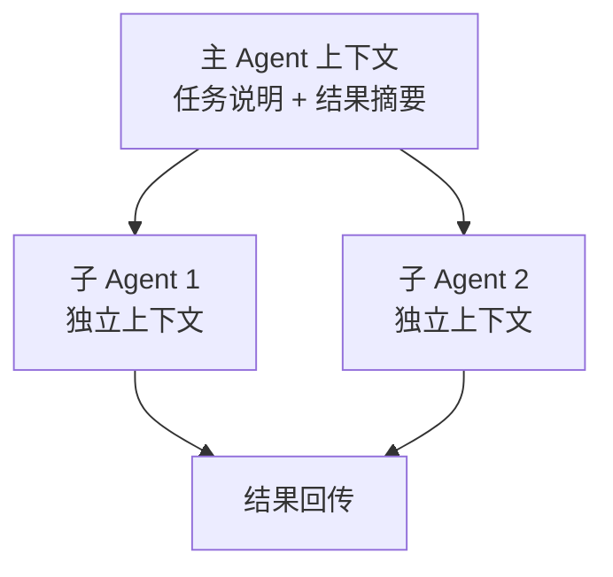

# 25 · 多智能体的作用是分割上下文

> 章节：第五章 Multi-Agent

## 生产中会遇到的问题

把一个任务交给多个 Agent 处理时，常见的做法是按角色分配：产品经理、开发者、审查者。角色设定写得很详细，实际运行时每个 Agent 的表现与单个 Agent 没有区别，协调成本却增加了。原因在于角色名称本身不产生任何变化，产生变化的是每个 Agent 看到的内容不同。

## 底层机制

单个 Agent 处理复杂任务时遇到的限制来自上下文。一个任务包含探索、实现、验证三个阶段，三个阶段需要的信息不同。全部放在一个上下文里会造成两种损失：阶段之间的信息互相干扰，总长度接近窗口上限。

子智能体的价值在于为每个阶段提供一份独立的上下文。主 Agent 只把任务说明交给子智能体，子智能体在自己的上下文里完成工作，最后把结果回传。



隔离强度按回传内容划分：

| 回传方式 | 主上下文开销 | 信息损失 |
|----------|--------------|----------|
| 只回传结论 | 最低 | 最大 |
| 回传结论与关键证据 | 中 | 中 |
| 回传完整过程 | 最高 | 无 |

## 实现要点

**任务说明必须自包含。** 子智能体看不到主对话，任务说明里需要包含目标、约束、输入位置、输出要求、终止条件。

**回传格式结构化。** 固定字段的返回值比自然语言段落更稳定。

```typescript
type SubTaskResult = {
  summary: string;
  artifacts: string[];
  evidence: string[];
  unresolved: string[];
  usage: { inputTokens: number; outputTokens: number };
};
```

`unresolved` 字段用于传递未解决的问题，缺少这个字段时主 Agent 会认为任务已经完成。

**预算传递。** 子任务从父任务的可用额度中划分。

**写入隔离。** 并行执行的子智能体如果需要写入，应当各自在独立的工作目录或独立分支内进行。

## pi 的做法

pi 的子智能体机制把「上下文如何分割」做成了显式参数和显式定义文件。

**上下文模式。** 启动子智能体时可以指定 `context`，取值为 `fresh`、`fork`、`profile`。

| 取值 | 子会话看到的内容 | 适用场景 |
|------|------------------|----------|
| `fresh` | 只有任务说明 | 子任务与主对话无关，或者主对话包含大量无关内容 |
| `fork` | 父会话记录的剪枝副本 | 子任务需要主对话的背景，但不需要全部工具结果 |
| `profile` | 由 agent 定义声明的默认模式 | 角色固定、模式稳定的常用子智能体 |

`fork` 会先做剪枝。剪枝逻辑在 `pi-subagents/src/shared/pruned-fork.ts`，会话内容与工作目录分别处理。这一处设计的目的正是控制主上下文的传递量：需要背景时不必把所有工具结果一起带进去。

**子智能体是一个 Markdown 文件。** agent 定义用 frontmatter 声明名称、说明与工具白名单，正文是系统提示词。

```yaml
---
name: scout
description: Fast codebase recon
tools: read, grep, find, ls
---

Your system prompt goes here.
```

发现顺序按优先级排列：内置、已安装包、使用者目录、项目目录，同名的以高优先级覆盖。项目目录里的定义优先于使用者目录，使用者目录优先于包与内置。

**回传按用途分层。** 子智能体的结果可以只作为文本返回，也可以写入指定路径。`output` 参数指定输出文件，`outputMode` 取 `file-only` 时结果不进主上下文只写文件；`outputSchema` 让返回值带结构；`acceptance` 与 `gate` 让结果先过一个校验命令再返回。需要细节时主 Agent 读文件，需要结论时读返回值，两条路径分开。

**子会话是独立会话。** 每个子智能体有自己的会话文件与会话标识，可以单独查看、单独恢复（`resume`）与单独控制（`interrupt`、`stop`、`steer`）。

## 常见错误

第一个错误是按角色名称划分。角色名称不改变任何行为，改变行为的是上下文内容与工具白名单。

第二个错误是任务说明引用主对话内容。子智能体看不到这些内容，会按错误的理解执行。

第三个错误是回传完整过程。主上下文被中间过程填满，隔离的收益被抵消。

第四个错误是给子智能体完整工具集。只读任务拿到写入工具，既增加选择负担也扩大风险面。

第五个错误是并行执行的子智能体写入同一位置。结果取决于执行顺序。

## 自检问题

1. 你的子智能体任务说明是否自包含？
2. 回传内容包含哪些字段，未解决事项如何传递？
3. 你的子智能体使用的是哪种上下文模式？
4. 只读任务的子智能体拿到写入工具了吗？