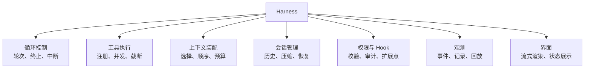

# 27 · Harness 是什么

> 章节：第六章 Harness 进阶

## 生产中会遇到的问题

两个产品使用同一个模型，一个用起来顺畅，另一个频繁出问题。差别不在模型上，在模型外面的那层程序上。同一天接入同一个模型，两个产品的表现差异可以大到使用者认为是两个不同的模型。

## 底层机制

Harness 指模型之外的全部程序。它包含以下部分：

Harness 的质量决定三件事：

**信息质量。** 模型每一轮看到什么内容由 Harness 决定。同一份模型能力，输入内容质量的差别会造成明显的输出差别。

**失败表现。** 模型输出不符合预期时，Harness 决定如何恢复。有中断能力时可以停止并保留进展，没有时只能等待超时或者直接失败。

**成本结构。** 上下文装配方式、压缩时机、缓存命中率都在 Harness 里控制。同一个任务的成本在不同 Harness 下可以相差数倍。

## 实现要点

**中断能力需要贯穿全局。** 从界面发起的取消需要传递到请求层、工具执行层、子智能体层。

**状态持久化按会话粒度。** 会话状态包含消息历史、工具调用记录、当前阶段。进程重启之后需要能恢复。写入方式使用临时文件加改名的方式，避免写入中断造成文件损坏。

**错误分类处理。** 可恢复错误与不可恢复错误分开。

**扩展点预留。** 权限校验、审计记录、上下文注入这三处需要在设计时留出扩展位置。

## pi 的做法

pi 的 Harness 分成两个包，边界清楚。

**`pi-agent-core/dist/harness/` 是与界面无关的外壳。**

| 目录或文件 | 职责 |
|------------|------|
| `agent-harness.js` | 外壳的组装与对外接口 |
| `hooks.js` | Hook 注册表与各扩展点的调用顺序 |
| `events.js` | 事件总线，按类型订阅，批量投递 |
| `telemetry.js` | 遥测跨度 |
| `compaction/` | 压缩与分支摘要 |
| `session/` | 会话存储接口与内存实现 |
| `execution/` | 工具执行相关逻辑 |
| `env/nodejs.js` | 运行环境适配 |
| `context.js` | 中止信号与上下文传递 |
| `pico3/` | 较小规模运行时的实现集合 |

**`pi-coding-agent/dist/core/` 是应用层的外壳。**

| 文件 | 职责 |
|------|------|
| `agent-session.js` | 会话运行主控，压缩触发、重试预算、用量统计都在这里 |
| `session-manager.js` | 会话树的读写、投影、分支 |
| `model-runtime.js` | 供应方组装、凭证、模型快照 |
| `settings-manager.js` | 设置读取与热更新 |
| `system-prompt.js` | 系统提示词段落组装与增量更新 |
| `skills.js` | 技能发现与注入 |
| `trust-manager.js` | 项目信任判定 |
| `resource-loader.js` | 各类资源的发现与加载 |
| `tools/` | 内置工具 |
| `compaction/` | 压缩策略 |
| `cache-warmer.js`、`cache-stats.js` | 缓存续期与误失统计 |
| `modes/` | 交互模式与 RPC 模式 |

两个包的分工给出了一个可参考的判断标准：与界面、与终端无关的部分放核心，与具体产品行为有关的部分放应用层。`prompt-templates.js`、`slash-commands.js` 这类文件在两边都存在，各自的职责按这个标准划分。

**中止信号的传递。** `context.js` 提供 `withAbortSignal`，Hook 调用与工具执行都通过它拿到当前的中止信号。`agent-loop.js` 在请求前后、并发批次内逐项检查 `signal.aborted`，任一层忽略取消都会让取消失效，因此这里逐层检查。

**状态持久化。** 会话写入采用可恢复的方式，条目按行追加，每一行是完整 JSON。写入过程中断只会丢掉最后一行，之前的记录不受影响。

## 常见错误

第一个错误是把 Harness 当作胶水代码。结构随意，后续每次新增能力都需要改动多处。

第二个错误是中断只处理最外层。请求被取消但工具仍在执行，或者子智能体继续运行。

第三个错误是没有状态持久化。进程重启之后会话全部丢失。

第四个错误是所有错误统一处理。鉴权失败被当作可重试错误反复重试。

第五个错误是把界面状态与内部状态分开维护。两者不一致时无法判断哪个准确。

## 自检问题

1. 你的 Harness 包含哪些模块，各自对应哪个文件？
2. 取消操作能传递到子智能体和工具执行层吗？
3. 进程重启之后会话能恢复吗？
4. 权限校验、审计记录、上下文注入三处扩展点在哪里？