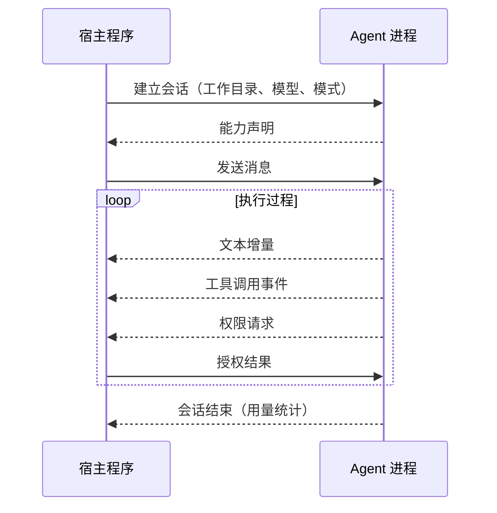

# 30 · 控制接口与 RPC 模式

> 章节：第六章 Harness 进阶

## 生产中会遇到的问题

Agent 程序与它的前端界面绑在一起。命令行界面、编辑器插件、聊天机器人各自实现一套交互逻辑，Agent 的循环与工具执行被复制成多份。增加一个新的接入方式意味着再复制一遍。

控制接口解决的是这个问题：把 Agent 能力以协议形式暴露，任何符合协议的宿主程序都可以驱动它。

## 底层机制

MCP 与控制接口的方向相反：

| 协议 | 方向 | 解决的问题 |
|------|------|------------|
| MCP | Agent 使用外部能力 | 工具复用 |
| 控制接口 | 外部程序驱动 Agent | 界面复用 |

控制接口需要覆盖的内容：



需要标准的几类消息：会话建立与能力声明、消息发送、事件流输出、权限请求、文件读写代理、会话终止。

## 实现要点

**内部事件与协议消息一一对应。** Agent 内部已经有事件模型，协议层只是把它翻译成标准格式。

**权限请求需要完整的上下文。** 请求里包含工具名称、参数、涉及的文件或命令、风险等级。

**会话状态由 Agent 持有。** 宿主程序只持有界面状态。

**错误分层。** 协议层错误与执行错误分开表达。

## pi 的做法

pi 的 RPC 模式就是上面这套结构的完整实现，`docs/rpc.md` 把协议约定写得很细。

**启动方式与进程模型。**

```bash
pi --mode rpc --no-session
```

长驻子进程，其余命令行参数仍然生效：工作目录、模型、工具、资源、会话行为都由普通参数选择。

**四类记录。**

| 方向 | 记录 | 用途 |
|------|------|------|
| 标准输入 | 命令 | 发起提示、查询状态、修改配置、管理会话 |
| 标准输出 | 响应 | 报告单条命令是否成功并返回数据 |
| 标准输出 | 会话事件 | 流出运行、消息、工具、队列、压缩、重试等活动 |
| 双向 | 扩展界面记录 | 转发扩展的交互请求 |

**命令与响应的关联。** 每条命令可以带一个字符串 `id`，对应的响应原样带回。文档明确要求：并发命令超过一条时必须使用唯一标识，客户端按标识关联，因为命令处理是异步的。

**帧格式有硬约束。** 严格按行分隔的 JSON，一行一个完整对象，以换行结束。读标准输出时只能按换行切分，不能使用会把 Unicode 行分隔符与段落分隔符也当成边界的通用行读取器，因为那两个字符在 JSON 字符串里是合法内容。标准输出专供协议记录，诊断与应用日志走标准错误。

**背压需要客户端配合。** pi 会遵循标准输出的背压，但停止读取的客户端会让进程停滞；写入命令时也要遵循标准输入的背压。

**生命周期语义值得单独记住。** `prompt` 命令返回成功只表示提示已被接受、排队或处理，不代表模型工作已经完成。`agent_end` 标记一次低层运行的结束，但之后可能还有重试、溢出恢复、压缩、插入消息、后续任务。客户端需要等到 `agent_settled` 才能确定 pi 不会自动继续。另外必须在发送提示之前先订阅事件，否则可能错过一次很快的完成——客户端库里的 `promptAndWait` 内部就是这么做的。

**关闭方式。** 关闭子进程的标准输入即请求正常退出，pi 会先释放当前运行时。客户端仍然需要处理进程信号与意外退出。

**与 SDK 的分工。** 进程内的 Node.js 或 Bun 集成使用 SDK，跨语言或需要进程隔离的集成使用 RPC。两种接入方式共用同一套会话与运行机制。

## 常见错误

第一个错误是协议层与内部事件两套模型并行维护。两边行为不一致，问题难以定位。

第二个错误是按响应顺序关联命令。并发命令返回顺序与发送顺序不一致。

第三个错误是用通用行读取器解析输出。JSON 字符串里的行分隔符会造成错误切分。

第四个错误是把 `prompt` 成功响应当作工作完成。真正需要等待的是运行稳定下来那一刻。

第五个错误是先把提示发出去再订阅事件。极快的完成会被漏掉。

第六个错误是把标准错误当作协议数据解析。诊断信息属于标准错误，不属于协议记录。

## 自检问题

1. 你的 Agent 有几种前端，各自实现了几套交互逻辑？
2. 你的命令与响应通过什么方式关联？
3. 你的协议输出会被日志污染吗？
4. 你怎么判断一次运行真的结束了？