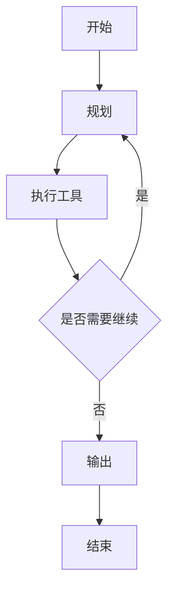

# 31 · 图结构控制流与显式循环

> 章节：第七章 回到框架

## 生产中会遇到的问题

手写的循环在流程复杂之后变得难以维护。条件分支嵌套、状态在多个函数之间传递、需要回到之前的某一步重新执行、需要人工审批节点，这些需求用 `while` 循环与若干条件判断表达之后，代码的可读性迅速下降。

图结构框架把循环表达成图：节点是处理步骤，边是转移条件，状态是节点之间共享的数据。

## 底层机制

三个概念构成图结构的全部内容：

**状态。** 一个在节点之间流转的对象，每个节点读取它并返回需要更新的字段。字段的合并方式由注解定义，例如数组类型默认采用追加合并。

**节点。** 一个函数，输入是当前状态，输出是需要更新的状态字段。

**边。** 普通边表示固定转移，条件边表示根据状态判断下一步走哪个节点。循环通过在图中形成回路表达。



## 实现要点

```typescript
const graph = new StateGraph(State)
  .addNode('plan', planNode)
  .addNode('execute', executeNode)
  .addEdge(START, 'plan')
  .addConditionalEdges('plan', routeAfterPlan, { execute: 'execute', finish: END })
  .addEdge('execute', 'plan');

const app = graph.compile({ checkpointer: new MemorySaver() });
```

**状态合并方式必须显式声明。** 使用默认覆盖时，消息数组会在每一轮被新值替换，历史全部丢失。

**检查点。** 传入检查点存储之后，每次节点执行完成都会保存状态。这让三件事成为可能：进程重启之后从上次位置继续、回到之前的某个状态重新执行、在指定节点暂停等待人工输入。

**轮数与预算。** 图结构本身不限制循环次数，需要在路由函数里判断当前轮数。

## pi 的做法

pi 没有引入图结构。它把同一个问题用另外三个机制解决，这三处都可以核对。

**机制一：循环保持线性，分支能力交给会话树。** `agent-loop.js` 的 `runLoop` 是两层 `while`，没有条件边，也没有状态机。需要「回到之前某一步」时，解法是在会话树上从历史节点继续，形成新分支。`dist/core/session-manager.js` 管理树的读写与投影，`compaction/branch-summarization.js` 负责在换分支时把原分支的关键信息压成摘要带过去。

这个选择的直接结果是：回溯能力不依赖编排层的复杂度，而依赖存储结构。代价是回溯发生在整条会话的粒度上，无法像图节点那样回溯到某一个细粒度步骤。

**机制二：暂停与人工介入通过插入消息与 Hook 实现。** 需要人判断时，`before_tool` 可以阻止执行并给出理由；需要补充条件时，可以在运行中插入 steering 消息；需要在某个工具上暂停，`before_tool` 返回阻止结果即可。这些都不需要把流程改写成图。

**机制三：中间状态持久化靠会话文件与压缩条目。** 会话条目按行追加，进程重启之后读回。压缩条目记录「从这里开始保留」，因此恢复之后请求不会重新包含已经压缩掉的内容。上下文编辑条目进一步允许把某一批消息从模型上下文中省略，同时保留在文件里。

**收益与代价。** 线性循环的好处是读一遍就能掌握全部控制流，调试时不需要在框架内部寻找实际执行路径。代价是复杂条件流的表达要靠代码组织，结构声明能提供的信息更少。判断依据仍然是控制流的复杂度：分支少、跳转少时，显式循环更容易维护；分支多、需要细粒度回溯、需要把流程画出来与团队讨论时，图结构的收益更大。

## 常见错误

第一个错误是状态合并方式使用默认覆盖。历史数据在第二轮丢失。

第二个错误是把所有逻辑放进单个节点。图结构退化成一条直线。

第三个错误是在节点内部抛出异常期望框架重试。重试策略需要显式配置。

第四个错误是没有轮数上限。回路无限执行。

第五个错误是把检查点存储当作会话历史。检查点保存的是图状态，界面需要的历史记录仍需要单独维护。

## 自检问题

1. 你的控制流里有几条条件边？
2. 状态里哪些字段需要追加合并？
3. 中断恢复之后，外部如何把使用者的决定传进去？
4. 你的回溯发生在会话粒度还是步骤粒度？