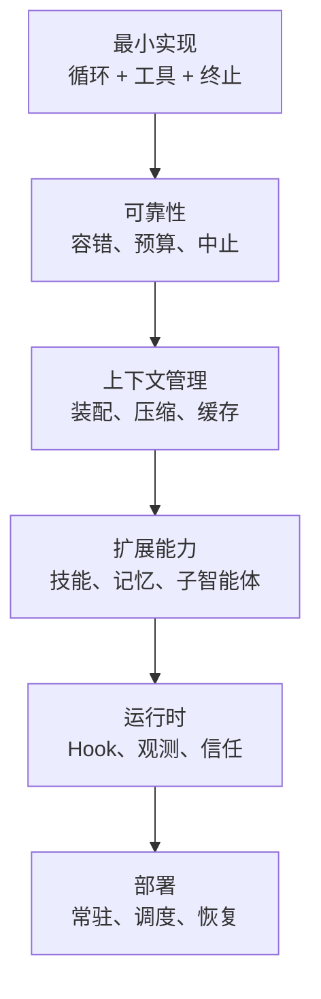

# 33 · 能力自评与后续方向

> 章节：收尾

## 能力自评

下面每一项都可以用 pi 的代码来检验。能指出位置、说清动机、并且能改一处并说明预期后果，才算掌握。

| 支柱 | 自查问题 | pi 中的位置 |
|------|----------|-------------|
| Agent Loop | 你的循环有哪几个终止条件，各自的触发频率是多少 | `agent-loop.js` 的 `runLoop`，以及 `stopReason` 的三个分支 |
| Tool System | 工具结果的处理流程是什么，谁决定并发 | `agent-loop.js` 的 `prepareToolCall` 与工具上的 `executionMode` |
| Context Engineering | 你能打印任意一次请求的完整内容并按部分统计占用吗 | `harness/hooks.js` 的 `before_payload`，`system-prompt.js` 的段落对象 |
| Memory 与 RAG | 记忆的作用范围与状态如何标注，冲突如何处理 | `~/.pi/agent/memory/` 目录结构与条目末尾的元数据块 |
| Multi-Agent | 子智能体的上下文隔离边界与回传格式是什么 | `pi-subagents` 的 `context` 参数、`output` 与 `outputSchema` |
| Harness | 你能不能在不重启进程的前提下改一项配置并立即生效 | `settings-manager.js` ，以及 RPC 模式的配置命令 |

## 从最小实现到生产系统的差异

最小实现包含四件事：消息数组、循环、工具注册、终止条件。生产系统在此基础上增加：

每一层都在前一层稳定之后才有意义。循环没有定型时加入上下文压缩，压缩策略会随循环结构变化而反复调整。观测尚未建立时部署上线，出问题只能靠推测。

## 判断力的训练方式

工程判断来自对约束条件的理解。同一件事在不同产品里的做法不同，差异的来源是约束条件的差异。遇到设计选择时，先确定约束：上下文预算多少、延迟要求多少、失败之后能否重试、操作有无副作用。约束确定之后，选择通常只剩下一个。

训练方式是按顺序做三件事：

1. 挑一个真实产品，按六大支柱写出它的设计选择；
2. 在自己的项目里找出对应的实现位置，记录差异；
3. 针对差异提出一个改动，说明预期的收益与代价。

第三件事是判断力增长最快的位置，因为它要求把收益与代价同时量化。

## 后续方向

按需要解决的问题选择方向：

| 遇到的问题 | 涉及内容 | pi 中的对应位置 |
|------------|----------|-----------------|
| 任务完成质量不稳定 | 上下文装配、验收流程 | `system-prompt.js`、`pi-subagents` 的 `acceptance` 与 `gate` |
| 成本增长过快 | 缓存命中、上下文压缩、模型选择 | `cache-stats.js`、`cache-warmer.js`、`compaction.js` |
| 长任务中断后无法继续 | 状态持久化、检查点 | `session-manager.js`、会话 JSONL 树 |
| 多个任务之间互相干扰 | 上下文隔离、工作目录隔离 | `pi-subagents` 的 `worktree` 与 `context` |
| 使用者不信任自动执行 | 权限边界、可观测性、审批接入 | `trust-manager.js`、`before_tool`、`docs/security.md` |

每根支柱都有继续深入的空间，深入的前提是当前这一层的实现已经可以稳定运行。出现新问题时，先判断它属于哪根支柱，再决定改动位置。